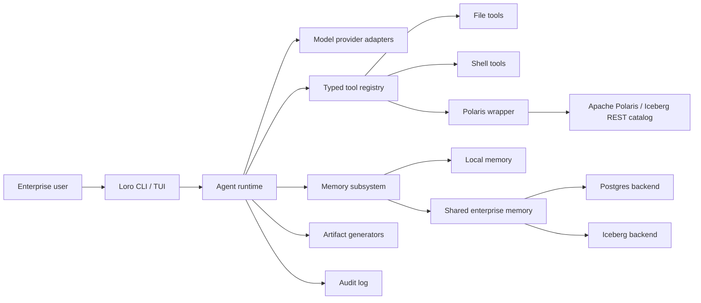

# Loro Architecture

Loro is a Python CLI agent harness for enterprise coding, governed data access, and productivity artifact generation. Its architecture is intentionally layered so the terminal UX, runtime loop, tools, memory, governance integrations, and artifacts can evolve independently.

## System Context

## Package Layout

- `loro.cli`: Typer command surface and command-specific orchestration.
- `loro.runtime`: task runtime, memory recall, audit events, and session persistence.
- `loro.config`: layered configuration model and environment overrides.
- `loro.permissions`: `allow` / `ask` / `deny` policy evaluation.
- `loro.provider_profiles`: built-in AI provider profile registry.
- `loro.providers`: provider lookup, validation, and local configuration writer.
- `loro.tools`: local file and shell tools, with more tools expected behind typed interfaces.
- `loro.tool_runtime`: explicit typed runtime tool-call parsing and execution.
- `loro.artifacts`: document, presentation, spreadsheet, brief, and provenance generators.
- `loro.memory`: local memory, shared-memory draft storage, schema generation, backend adapters, and shared-memory operations.
- `loro.polaris`: controlled read-only wrapper around the Polaris CLI.
- `loro.audit`: JSONL audit event writer.
- `loro.serialization`: small helpers for JSON-safe CLI output.
- `loro.sessions`: durable JSON session records.

## Runtime Flow

1. The CLI resolves config from managed, user, project, local, `LORO_CONFIG`, and `LORO_CONFIG_CONTENT`.
2. The runtime loads local memory and searches for memories relevant to the prompt.
3. The runtime emits `runtime.task_started`.
4. Explicit prompt tool directives are executed before the first model call.
5. The runtime calls the configured model and parses provider-neutral tool directives from
   the response.
6. Approved tool calls are executed, audited, and sent back to the model as structured text.
7. The loop repeats until the model responds without tool directives or `[runtime].max_steps`
   is reached.
8. The runtime creates a session summary, including tool execution payloads and stop reason,
   and persists it to the configured session store.
9. The runtime emits `runtime.task_completed`.
10. Artifact and tool commands emit their own audit events with previews and metadata, not full sensitive payloads.

The current model-directed loop uses text directives such as
`@tool {"name": "file.read", "args": {"path": "README.md"}}`. Native provider tool-calling
can map into the same internal `ToolCall` type as provider adapters mature. The runtime
registry currently exposes file read/search, local memory search, permission-gated shell
execution, read-only Polaris passthrough, and artifact generation with provenance.

## Configuration

Loro config is loaded in increasing precedence:

1. `/etc/loro/config.toml`
2. `~/.config/loro/config.toml`
3. `.loro/config.toml`
4. `.loro/config.local.toml`
5. File referenced by `LORO_CONFIG`
6. Inline TOML from `LORO_CONFIG_CONTENT`

Managed enterprise policy will eventually be made non-overridable. Today the merge model is simple deep-merge precedence.

## Permissions

The permission engine evaluates requests as:

- `allow`: tool may execute.
- `ask`: tool requires an explicit CLI approval flag or future interactive approval.
- `deny`: tool is blocked.

Ordered permission rules can override per-tool defaults with case-insensitive glob matches
on tool, action, and target. The first matching rule wins.

Current examples:

- `loro shell run --yes -- python -c "print('ok')"` requires `--yes` when shell policy is `ask`.
- `loro file read` and `loro file search` are read-only and internally approved for the current CLI command.

Future work should add managed enterprise denies and richer data-scope matchers.

## AI Providers

Provider profiles are stored in `loro.providers`. Profiles capture:

- Provider name and display name.
- Default primary model.
- Default small/fast model.
- API key environment variable.
- Base URL.
- Protocol family.
- Notes for special providers.

Current profiles cover OpenAI, Anthropic, Gemini, Mistral, Groq, Cerebras, Together AI, Fireworks AI, DeepSeek, xAI, Perplexity, OpenRouter, Nous Portal, OpenCode Zen, OpenCode Go, Azure OpenAI, AWS Bedrock, Ollama, LM Studio, vLLM, and generic OpenAI-compatible endpoints.

`loro configure` writes `.loro/config.local.toml`, keeping user-specific provider choices and endpoint details out of source control. `loro providers check` validates required environment variables. `loro providers request` prints a redacted request payload without performing network I/O. `loro.models` contains the request-building adapter layer for mock, OpenAI-compatible, Anthropic, Gemini, and Ollama protocols. Bedrock remains profile-only until AWS SDK integration is added.

## Memory

Loro has two memory planes:

- Local memory: JSONL-backed today, private to the current environment, searchable by substring.
- Shared memory: schema-first scaffolding for explicit user-approved enterprise memory.

Shared memory writes must stay explicit. The agent can propose a memory, but only user-approved text should be staged or committed. Current code supports shared memory schema generation, draft records, `memory apply-schema` SQL dry runs, `memory commit-draft` SQL dry runs, Postgres readiness diagnostics, a Postgres adapter that can apply schema and execute explicit draft commits when `psycopg` plus a DSN are available, and an Iceberg adapter that renders configured DDL plus append/search SQL for future governed execution.

## Artifact Generation

Artifact commands use deterministic Python generators:

- Documents: Markdown and DOCX.
- Presentations: Markdown outline and PPTX.
- Spreadsheets: XLSX and CSV.
- Briefs: Markdown.

Each artifact write produces a `.provenance.json` sidecar with prompt preview, generated paths, assumptions, timestamp, and generator metadata.

## Polaris And Governed Data

The Polaris integration is intentionally controlled:

- `loro data catalogs` calls `polaris catalogs list` only when Polaris is enabled.
- Typed `loro data` commands cover catalog, namespace, table, view, role, privilege, and policy discovery.
- `loro data polaris ...` validates the resource/action pair against a read-only allowlist before executing.

Future work should expose governed table context to the agent loop and add higher-level access explanations.

## Persistence

Runtime files are ignored by Git:

- `.loro/audit.jsonl`
- `.loro/memory/`
- `.loro/sessions/`
- `artifacts/`

This keeps local usage out of source control while preserving inspectable state on disk.

## Testing Strategy

The MVP uses focused unit and CLI tests:

- Artifact creation and provenance.
- Audit JSONL writing.
- Config merge and environment overrides.
- Local memory search.
- Session roundtrips.
- File, shell, and Polaris tool behavior.
- Typer CLI smoke behavior.
- Postgres shared-memory SQL rendering and backend readiness checks.
- Iceberg shared-memory DDL and SQL rendering.

Integration tests for real Postgres, Iceberg, Polaris, and model providers should live behind optional test markers once those services are implemented.
