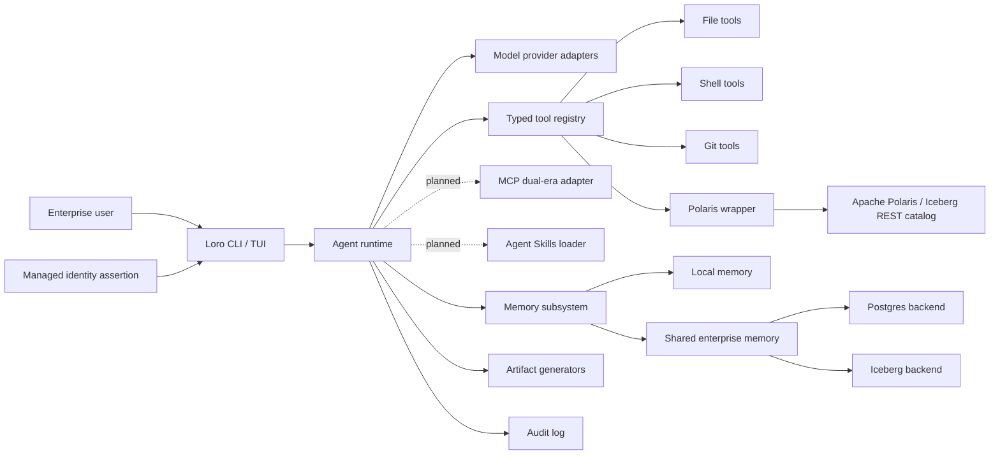

# Loro Architecture

Loro is a Python CLI agent harness for enterprise coding, governed data access, and productivity artifact generation. Its architecture is intentionally layered so the terminal UX, runtime loop, tools, memory, governance integrations, and artifacts can evolve independently.

## System Context

## Package Layout

- `loro.cli`: Typer command surface and command-specific orchestration.
- `loro.runtime`: task runtime, memory recall, audit events, and session persistence.
- `loro.config`: layered configuration model and environment overrides.
- `loro.identity`: typed identity resolution, diagnostics, and required-field validation.
- `loro.approvals`: identity-bound approval requests/records, expiration, and replay protection.
- `loro.permissions`: `allow` / `ask` / `deny` policy evaluation.
- `loro.resources`: canonical resource scopes for paths, commands, Git, memory, Polaris, and providers.
- `loro.provider_profiles`: built-in AI provider profile registry.
- `loro.providers`: provider lookup, validation, and local configuration writer.
- `loro.tools`: local file, shell, and Git tools, with more tools expected behind typed interfaces.
- `loro.tool_runtime`: explicit typed runtime tool-call parsing and execution.
- `loro.artifacts`: document, presentation, spreadsheet, brief, and provenance generators.
- `loro.memory`: local memory, shared-memory draft storage, schema generation, backend adapters, and shared-memory operations.
- `loro.polaris`: controlled read-only wrapper around the Polaris CLI.
- `loro.audit`: versioned event envelope, JSONL/HTTP sinks, bounded buffer, and delivery controls.
- `loro.serialization`: small helpers for JSON-safe CLI output.
- `loro.sessions`: durable JSON session records.

Planned extension boundaries are `loro.mcp` for MCP client/server interoperability and
`loro.skills` for Agent Skills discovery and progressive disclosure. They are not implemented
yet. Both must adapt into the existing tool, permission, approval, normalized-resource,
sandbox, session, and audit boundaries rather than create independent execution paths. See the
[MCP And Agent Skills Roadmap](docs/mcp-skills-roadmap.md).

## Runtime Flow

1. The CLI resolves config from system, user, project, local, `LORO_CONFIG`, and
   `LORO_CONFIG_CONTENT`, then applies managed enterprise overlays last.
2. Loro resolves identity from configuration/environment, validates managed required fields,
   and fails before runtime construction when they are missing.
3. The runtime loads local memory and, when enabled, searches the identity tenant's shared
   memory for relevant cited records.
4. The runtime emits `runtime.task_started` with identity attribution.
5. Explicit prompt tool directives are executed before the first model call.
6. The runtime calls the configured model and parses provider-neutral tool directives from
   the response.
7. Ask-gated actions create an exact approval request. Trusted interactive approval is recorded
   before the tool executes; model-provided approval fields are not trusted.
8. Approved tool calls are executed, audited, and sent back to the model as structured text.
9. The loop repeats until the model responds without tool directives or `[runtime].max_steps`
   is reached.
10. The runtime creates a session summary, including identity, tool execution payloads, and stop
    reason, and persists it to the configured session store.
11. The runtime emits `runtime.task_completed`.
12. Artifact and tool commands emit their own audit events with identity, previews, and metadata,
    not full sensitive payloads.

Audit schema `1.0` promotes identity, trace, action/target, policy, approval, result, and
redaction metadata into stable top-level fields while retaining legacy details. JSONL is the
default sink. HTTP delivery retries with exponential backoff, then writes the complete event to
a bounded JSONL buffer. Warning mode continues visibly; fail mode raises after buffering.
`loro audit flush` retries buffered events in order. See
[Audit Events And Delivery](docs/audit.md).

The current model-directed loop uses text directives such as
`@tool {"name": "file.read", "args": {"path": "README.md"}}`. Native provider tool-calling
can map into the same internal `ToolCall` type as provider adapters mature. The runtime
registry currently exposes file read/search, local memory search, permission-gated shell
execution, read-only Polaris passthrough, artifact generation with provenance, approved file
writes/replacements, and Git status/diff/show/add/commit helpers.

## Configuration

Loro config is loaded in increasing precedence:

1. `/etc/loro/config.toml`
2. `~/.config/loro/config.toml`
3. `.loro/config.toml`
4. `.loro/config.local.toml`
5. File referenced by `LORO_CONFIG`
6. Inline TOML from `LORO_CONFIG_CONTENT`
7. Non-overridable managed overlays from `/etc/loro/managed.toml`, `LORO_MANAGED_CONFIG`,
   and `LORO_MANAGED_CONFIG_CONTENT`

Managed overlays use the same TOML schema as normal config but are re-applied after runtime
overrides, making them suitable for enterprise permission denies, audit defaults, shared
memory policy, required identity fields, and governed data configuration.

## Identity

`IdentityContext` carries subject, display name, organization, tenant, groups, roles,
authentication method, session identifier, and source. Resolved configuration fields override
`LORO_IDENTITY_*` environment assertions; missing values fall back to the local user and default
tenant. Managed `required_fields` make runtime and audited commands fail closed.

Audit events and session records include the non-secret identity payload. Runtime shared-memory
recall uses the identity tenant, and shared-memory CLI operations use identity tenant/subject as
defaults. This foundation does not authenticate environment assertions or authorize caller-
supplied tenant overrides; those controls belong to the approval and resource-scope layers.

## Permissions

The permission engine evaluates requests as:

- `allow`: tool may execute.
- `ask`: tool requires a trusted interactive or policy-enabled non-interactive approval record.
- `deny`: tool is blocked.

Ordered permission rules can override per-tool defaults with legacy glob matches on tool,
action, and target or structured matches on normalized resource kind and fields. The first
matching rule wins. Results identify the policy version, source, matched rule, and resource.

Current examples:

- `loro shell run -- python -c "print('ok')"` prompts when shell policy is `ask`.
- `--yes` remains a non-enterprise automation path and can be disabled by managed policy.
- `loro file read` and `loro file search` are read-only and internally approved for the current CLI command.
- Runtime file writes, Git mutations, and shell execution require explicit approval unless
  policy sets the relevant action to `allow`.

Approval requests bind canonical arguments, identity, session, normalized target, decision,
policy version/source, and expiration. One-time approvals are consumed once; exact session
approvals can be reused until expiry. Filesystem roots resolve symlinks and traversal before
policy or approval, while shell policy receives invoked and resolved executable fields plus the
exact argument array. See [Normalized Resource Policy](docs/policy.md).

## AI Providers

Provider profiles are stored in `loro.providers`. Profiles capture:

- Provider name and display name.
- Default primary model.
- Default small/fast model.
- API key environment variable.
- Base URL.
- Protocol family.
- Notes for special providers.

Current profiles cover OpenAI, Anthropic, Gemini, Mistral, Groq, Cerebras, Together AI, Fireworks AI, DeepSeek, xAI, Perplexity, OpenRouter, Nous Portal, OpenCode Zen, OpenCode Go, Azure OpenAI, AWS Bedrock, Ollama, LM Studio, vLLM, and generic OpenAI-compatible endpoints.

`loro configure` writes `.loro/config.local.toml`, keeping user-specific provider choices and endpoint details out of source control. `loro providers check` validates required environment variables. `loro providers request` prints a redacted request payload without performing network I/O. `loro.models` contains the request-building adapter layer for mock, OpenAI-compatible, Anthropic, Gemini, Ollama, and optional AWS Bedrock protocols. `loro.model_tools` normalizes native OpenAI-compatible `tool_calls`, Anthropic `tool_use`, Gemini `functionCall`, and Bedrock `toolUse` response payloads into the runtime's provider-neutral tool-call shape. Textual `@tool` directives remain supported for deterministic tests and providers without native tool calling.

## Memory

Loro has two memory planes:

- Local memory: JSONL-backed today, private to the current environment, searchable by substring.
- Shared memory: schema-first scaffolding for explicit user-approved enterprise memory.

Shared memory writes must stay explicit. The agent can propose a memory, but only
user-approved text should be staged or committed. Current code supports shared memory schema
generation, draft records, proposal records, `memory shared-search`, `memory apply-schema`
SQL dry runs, `memory commit-draft` SQL dry runs, Postgres readiness diagnostics, a Postgres
adapter that can apply schema, execute explicit draft commits, and execute search when
`psycopg` plus a DSN are available, and an Iceberg adapter that renders configured DDL plus
append/search SQL. The Iceberg adapter can also execute search and explicit draft commits
through a configured PyIceberg catalog, typically a Polaris-governed REST catalog. Runtime
shared-memory recall includes citations so responses can identify the backend, tenant, scope,
and memory id.

## Artifact Generation

Artifact commands use deterministic Python generators:

- Documents: Markdown and DOCX.
- Presentations: Markdown outline and PPTX.
- Spreadsheets: XLSX and CSV.
- Briefs: Markdown.

Each artifact write produces a `.provenance.json` sidecar with prompt preview, generated paths, assumptions, timestamp, and generator metadata.

## Polaris And Governed Data

The Polaris integration is intentionally controlled:

- `loro data catalogs` calls `polaris catalogs list` only when Polaris is enabled.
- Typed `loro data` commands cover catalog, namespace, table, view, role, privilege, and policy discovery.
- `loro data polaris ...` validates the resource/action pair against a read-only allowlist before executing.

Future work should expose governed table context to the agent loop and add higher-level access explanations.

## Persistence

Runtime files are ignored by Git:

- `.loro/audit.jsonl`
- `.loro/audit-buffer.jsonl`
- `.loro/memory/`
- `.loro/sessions/`
- `artifacts/`

This keeps local usage out of source control while preserving inspectable state on disk.

## Testing Strategy

The MVP uses focused unit and CLI tests:

- Artifact creation and provenance.
- Audit JSONL writing.
- Config merge and environment overrides.
- Local memory search.
- Session roundtrips.
- File, shell, and Polaris tool behavior.
- Typer CLI smoke behavior.
- Postgres shared-memory SQL rendering and backend readiness checks.
- Iceberg shared-memory DDL and SQL rendering.

Integration tests for real Postgres, Iceberg, Polaris, and model providers should live behind optional test markers once those services are implemented.
