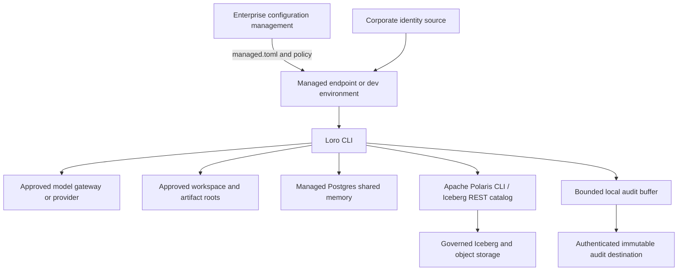

# Enterprise Reference Deployment

## Supported Pilot Shape

Loro's first enterprise deployment is a limited pilot, not a general-purpose autonomous agent
service. It uses a centrally managed CLI on controlled developer workstations or ephemeral
development environments, an approved model gateway/provider, non-overridable managed policy,
Postgres shared memory, read-only Polaris discovery, and the implemented authenticated HTTP audit
sink connected to an enterprise-owned destination.

Postgres is the reference shared-memory backend for the first pilot because its transactional
and isolation behavior is straightforward to validate. Polaris-governed Iceberg is the
scale-out path after equivalent tenant, lifecycle, audit, and recovery evidence exists.

## Logical Topology



Loro 0.4.1 provides typed identity context, external HTTP audit delivery, and enforceable sandbox
profiles. Corporate identity verification, a production audit destination, and supported-platform
sandbox evidence are deployment responsibilities; a pilot must not claim those controls until its
evidence items are closed.

## Deployment Matrix

| Component | First supported choice | Current proof | Pilot requirement |
| --- | --- | --- | --- |
| Operating system | Managed Linux workstation/container; Ubuntu is the CI reference | `ubuntu-latest` CI | Pin a tested enterprise distribution/version and endpoint baseline. |
| Python | 3.11 through 3.14 | CI matrix | Use enterprise-patched CPython. |
| Loro distribution | `loro-agent` from a controlled package mirror | PyPI release, clean-install smoke, SBOM, checksums, and GitHub/Sigstore provenance | Pin exact version/hash, verify provenance, and mirror approved artifacts. |
| Model access | Internal OpenAI-compatible gateway preferred; otherwise explicitly approved direct provider | Provider unit and controlled live smoke tests | Record class ceiling, residency, retention, TLS/proxy, budgets, and fallback policy. |
| Configuration | `/etc/loro/managed.toml` or `LORO_MANAGED_CONFIG`; managed values load last | Unit tests cover precedence | Protect distribution and integrity; validate version and fail closed when required. |
| Identity | Typed context propagated to runtime, approvals, memory, sessions, and audit | Context foundation implemented | Integrate and verify a corporate assertion source before pilot attribution is trusted. |
| Shared memory | Managed Postgres | Opt-in Testcontainers integration | Pin supported Postgres version; require TLS, least privilege, backup/restore, tenant tests, and retention. |
| Scale-out memory | Polaris-governed Iceberg REST catalog | PyIceberg adapter plus service/dry-run quickstart | Not in first production pilot until full read/write, isolation, lifecycle, and recovery tests pass. |
| Governed data | Polaris CLI typed read-only discovery; Iceberg REST for approved memory access | Unit tests and opt-in Polaris smoke | Pin Polaris CLI/server versions, authenticate as the user/workload, scope catalogs/resources, and prove denial behavior. |
| Audit | Schema `1.0`; JSONL development sink; bearer-authenticated HTTP sink with retry, bounded buffering, doctor/flush | Unit and failure-injection tests | Deploy and load-test the collector; add destination immutability/tamper evidence, retention, alerting, and stronger authentication as required before pilot. |
| Isolation | Tool policy and workspace boundaries | Unit tests | Named enforceable sandbox profile, environment allowlist, network rules, time/output limits before broader pilot. |

Version numbers for Postgres, Polaris, object storage, and the model gateway remain deployment
decisions. The deployment owner must pin and test them in version-controlled infrastructure;
"latest" images or clients are not an acceptable pilot baseline.

## Required Components And Responsibilities

| Role | Responsibility | Named owner |
| --- | --- | --- |
| Product owner | Approved use cases, limitations, pilot success measures. | TBD |
| Runtime owner | Agent loop, tools, sandbox profiles, provider behavior. | TBD |
| Identity/policy owner | Identity integration, managed policy, approvals, access reviews. | TBD |
| Memory/data owner | Postgres, Polaris/Iceberg, tenant isolation, lifecycle, backup/restore. | TBD |
| Security/privacy owner | Threat model, classification, DLP, incident response, risk acceptance. | TBD |
| Release owner | CI, dependencies, artifacts, signatures, SBOM, rollback. | TBD |
| Operations owner | Audit destination, monitoring, runbooks, on-call, recovery drills. | TBD |

No Phase 0 exit gate is complete until these `TBD` roles are assigned by the adopting
organization.

## Configuration Baseline

Managed configuration must set conservative permissions, disable prompt previews for sensitive
work, select an approved provider/gateway, require explicit shared-memory writes, constrain
Polaris, and point to environment-held credentials. Project and user configuration may become
more restrictive but must not override managed values.

```toml
[runtime]
max_steps = 5

[permissions]
version = "replace-with-managed-policy-version"
default = "deny"
shell = "ask"
edit = "ask"
web = "deny"
workspace_roots = ["/work/repos", "/work/documents"]

[memory.shared]
enabled = true
backend = "postgres"
write_policy = "explicit_user_dictation_only"
postgres_dsn_env = "LORO_POSTGRES_DSN"
postgres_schema = "loro_memory"

[polaris]
enabled = true
cli_path = "polaris"
require_role_inspection = true

[audit]
enabled = true
schema_version = "1.0"
sink = "http"
http_url = "https://audit.example.internal/v1/loro/events"
http_token_env = "LORO_AUDIT_TOKEN"
failure_mode = "fail"
buffer_path = "/var/lib/loro/audit-buffer.jsonl"
max_buffer_events = 1000
max_retries = 2
backoff_seconds = 0.25
timeout_seconds = 10
include_prompt_preview = false

[safety]
enabled = true
block_on_findings = true
```

This is a directional baseline, not a ready-to-deploy policy. Add deployment-specific
normalized resource rules; sandbox profiles, signed policy distribution, and external audit
destination hardening/validation remain later work.

## Network And Credential Boundaries

- Permit egress only to the approved provider/gateway, Postgres, Polaris/Iceberg endpoints,
  audit collector, package mirror, and explicitly approved task destinations.
- Use TLS with enterprise trust roots and certificate verification for every remote service.
- Supply provider, database, catalog, and cloud credentials from enterprise credential
  facilities. Do not place values in Loro config or repository files.
- Give Loro and each subprocess only the credentials it requires. Provider credentials must not
  be inherited by shell/Git/artifact tools by default.
- Use separate principals and storage for development, test, and production; never seed CI with
  production data.

## Data And Memory Controls

The first pilot should use Public or approved Internal data. Shared-memory tenant and scope
must come from trusted identity/policy, not prompt text. The Postgres role must have access only
to Loro's schema and required operations; tenant enforcement should be backed by database
controls where practical. Shared commits must retain source, actor, classification, timestamps,
review state, and an event record.

Polaris is used for read-only discovery and access explanation through typed operations. Loro
does not grant roles or privileges and does not treat catalog discovery as authorization to
query table contents. Governed queries require a separately approved engine and policy path.

## Rollout And Validation

1. Pin infrastructure/client versions and assign every owner.
2. Deploy an isolated non-production environment with synthetic Public/Internal data.
3. Verify identity, managed policy precedence, approval attribution, sandboxing, provider data
   routing, Postgres tenant isolation, external audit delivery, and Polaris denials.
4. Exercise provider outage, audit backlog, credential rotation, policy rollback, memory backup
   and restore, tenant offboarding, and suspected data exposure.
5. Admit a small user group and approved repositories under the most restrictive profile.
6. Expand data classes, providers, tools, or Iceberg usage only when their evidence is closed.

## Explicitly Unsupported In The First Pilot

- Autonomous shared-memory commits or model-created approvals.
- Unrestricted shell, filesystem, network, Git, or governed-data mutation.
- Caller-selected tenant identity without trusted identity/policy binding.
- Restricted data, raw production data extracts, or credentials in prompts/memory/artifacts.
- Silent provider fallback across residency or classification boundaries.
- Iceberg as the production shared-memory system before parity evidence exists.
- Claims of compliance certification, multi-region availability, or tamper-proof local audit.

Reproduction is complete only when version-controlled deployment manifests, managed policy,
sanitized test data, validation commands, and evidence artifacts are attached to the release.
