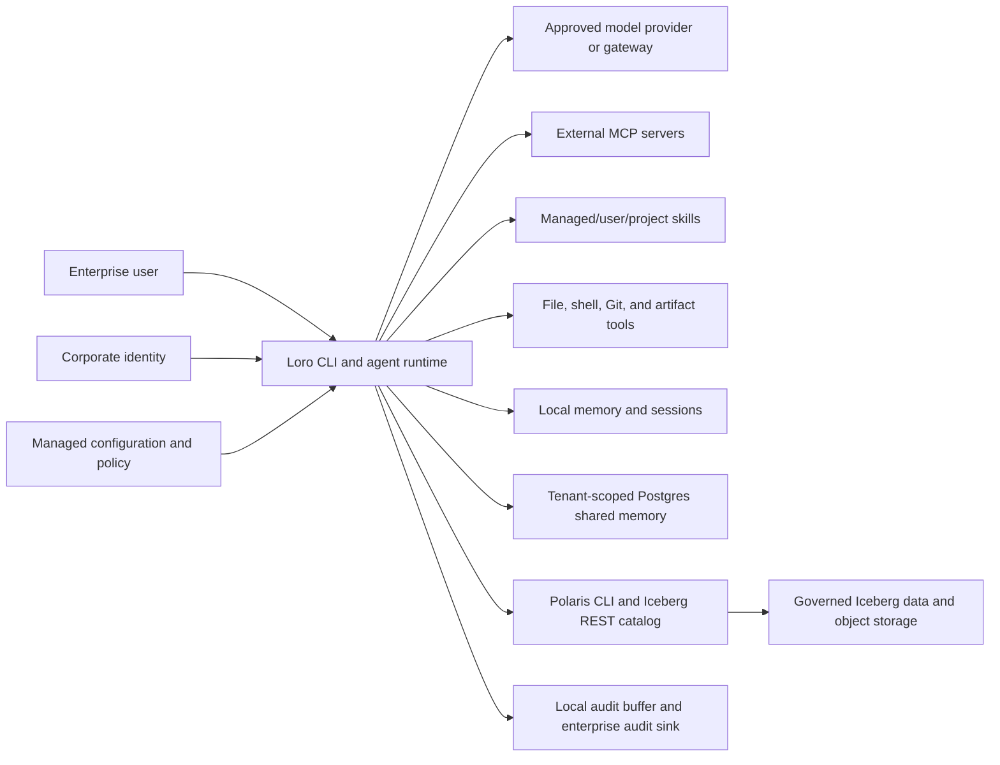

# Loro Threat Model

## Document Control

| Field | Value |
| --- | --- |
| Status | Draft for engineering and security review |
| Scope | Loro CLI 0.5.0 and the first enterprise reference deployment |
| Review cadence | Before each enterprise pilot release and after material data-flow changes |
| Accountable owner | Security owner (TBD) |
| Technical owners | Runtime, identity/policy, memory/data, and release owners (TBD) |

This document describes security assumptions and required controls. It is not a claim that
all controls are implemented. The [enterprise evidence register](enterprise-evidence.md)
tracks implementation and proof.

## Security Objectives

- A model cannot grant itself authority or convert untrusted content into approval.
- Tenant and resource boundaries are enforced in code and storage, not by prompt text.
- Shared memory is written only from explicit user dictation through a reviewable draft and
  commit flow.
- Secrets and sensitive data are minimized across prompts, providers, memory, artifacts,
  sessions, subprocesses, and audit records.
- Consequential actions can be attributed to an identity, policy decision, approval, and exact
  target.
- Failure of identity, managed policy, authorization, or required audit delivery fails closed.
- Compromise of one provider, repository, memory record, or tool result does not silently
  expand Loro's authority.

## System And Trust Boundaries

Trust boundaries exist between the user and model, runtime and tool subprocesses, workstation
and provider, tenant and shared storage, Loro and Polaris, and local audit storage and the
enterprise destination. Repository files, model output, tool output, recalled memories, and
governed-data metadata are all untrusted input.

## Protected Assets

- Provider, database, Polaris, object-store, and identity credentials.
- Source code, working files, generated artifacts, and Git history.
- Prompt content, model responses, sessions, local memory, and provenance sidecars.
- Shared memories and their tenant, classification, authorship, review, and lifecycle metadata.
- Governed catalog metadata and any data reached through an approved query engine.
- Managed policy, approval records, identity assertions, and audit evidence.
- Availability, cost budgets, and the integrity of agent decisions.

## Actors And Assumptions

- **Enterprise user:** authenticated person requesting work and approving consequential actions.
- **Administrator:** distributes managed configuration and policy; does not implicitly approve a
  specific user action.
- **Model provider or gateway:** processes supplied context but is not trusted to authorize tools.
- **Data platform:** Polaris, Postgres, Iceberg, and object storage enforce their own identities,
  privileges, encryption, and tenant boundaries.
- **Attacker:** may control prompt content, repository files, memory text, tool output, network
  responses, dependencies, or a compromised user endpoint.

The first pilot assumes managed endpoints, enterprise-controlled credentials, TLS-protected
services, least-privilege database/catalog roles, and an approved provider data-use agreement.
Loro does not replace endpoint security, provider governance, database authorization, or
Polaris access control.

## Threat Register

| ID | Threat and attack path | Impact | Current control | Required enterprise control | Evidence |
| --- | --- | --- | --- | --- | --- |
| TM-01 | Prompt injection in a user prompt, repository, tool result, governed metadata, or recalled memory tells the model to run a tool or reveal data. | Unauthorized action or disclosure. | Typed tools, bounded steps, normalized policy, identity-bound approval, sandbox profiles, trust labels, and adversarial tests. | Production policy review, enforceable-platform evidence, and enterprise red-team validation. | `tests/test_tools.py`, `tests/test_tool_runtime.py`, `tests/test_runtime.py`, and deployment evidence remain. |
| TM-02 | Model output supplies `approved=true` or otherwise attempts to approve its own file, shell, Git, or data action. | Arbitrary mutation or command execution. | Model/user tool-call origins are distinguished; trusted approval records bind canonical arguments, identity, session, decision, and expiry. | Add signed policy-version binding and durable enterprise approval evidence. | `tests/test_approvals.py` and `tests/test_tool_runtime.py`; policy-version evidence pending. |
| TM-03 | Path traversal, symlink substitution, glob ambiguity, command encoding, or shell argument confusion bypasses policy. | Access outside the workspace or unintended execution. | Typed canonical resources, symlink-aware roots, exact shell arguments, named subprocess profiles, minimized environments, and optional required Bubblewrap. | Production escape/TOCTOU tests and supported-platform review. | Resource, runtime-tool, and sandbox bypass tests exist; production evidence remains. |
| TM-04 | Credentials leak into prompts, native tool arguments, inherited subprocess environments, logs, sessions, memory, or artifacts. | Account compromise and data breach. | Environment/OS-vault provider credentials; model text and nested native arguments use the same managed output policy; subprocess environments are allowlist-built and leak-tested. | Extend isolation to every subprocess family; managed DLP and structured redaction metadata. | `tests/test_runtime.py`, `tests/test_sandbox.py`, and safety tests exist; enterprise DLP evidence pending. |
| TM-05 | Caller chooses another `tenant_id`, or a query/write omits tenant enforcement. | Cross-tenant memory disclosure or corruption. | Managed identity binding, adapter mismatch rejection, isolated drafts, forced Postgres RLS/session context, Iceberg filter pushdown, and negative tests. | Verify least-privilege production database roles and Polaris authorization in live cross-tenant tests. | Repository controls implemented; production-like isolation proof pending. |
| TM-06 | Poisoned shared memory influences future users or embeds malicious instructions. | Persistent prompt injection or bad enterprise guidance. | Explicit-only shared writes, drafts, citations, provenance, classification, scanning, and correction/deletion/hold lifecycle controls. | Enterprise reviewer policy, quarantine workflow, retrieval trust weighting, and production adversarial proof. | Memory lifecycle, tenant, draft/commit, and runtime tests exist; production evidence remains. |
| TM-07 | Local JSONL audit is modified, deleted, disabled, or lost during failure. | Actions cannot be reconstructed. | Versioned schema, process-safe hash-chained JSONL, optional final-hash anchors, authenticated HTTP sink, retry/backoff, bounded buffer, warn/fail modes, doctor/flush/verify, and failure-injection tests. | Destination immutability, stronger transport/signing where required, retention, and production outage proof. | Audit integrity, delivery, and runtime tests exist; operations evidence remains pending. |
| TM-08 | Malicious or compromised dependency, build action, package, or release artifact executes code. | Developer/user compromise and supply-chain breach. | Pinned security/build tools, SCA, static/secret/license scans, SBOM, checksums, and GitHub/Sigstore build provenance. | Protected branch/tag rules, trusted publishing, reviewer ownership, and organization risk acceptance. | CI, Security Evidence, and Release Evidence workflows; repository-administration proof remains external. |
| TM-09 | Provider retains, trains on, routes, or exposes enterprise content outside approved boundaries. | Confidentiality, residency, or contractual breach. | Configurable providers and internal OpenAI-compatible endpoints. | Approved-provider matrix, gateway enforcement, classification-aware routing, retention settings, egress controls, provider review. | Data-flow approval pending. |
| TM-10 | Artifact generation creates formulas, links, macros, scripts, misleading content, or unsafe paths. | Code execution, exfiltration, or harmful business decisions. | Fixed artifact generators, safety scan, provenance sidecars. | Safe output roots, formula/link policy, malware/content scanning, classification labels, human review before distribution. | Artifact tests partial; adversarial artifact tests pending. |
| TM-11 | Polaris CLI passthrough or REST configuration is used for mutation or broader discovery than intended. | Governed-data misuse or privilege escalation. | Typed read-only operations, a validated allowlist, normalized scopes, approval, and a named subprocess profile. | Production identity/authorization and Bubblewrap evidence. | Polaris unit and sandbox-path tests plus opt-in smoke exist; end-to-end proof pending. |
| TM-12 | Excessive loops, output, provider calls, scans, or queries consume money or capacity. | Denial of service and spend overrun. | Per-task step, tool-call, model-byte, token, configured-cost, retry, timeout, and output limits. | Distributed per-user/tenant concurrency and spend enforcement with production telemetry. | Budget and provider-transport tests exist; distributed enforcement remains external. |
| TM-13 | Session, local memory, provenance, or draft files on a workstation are read by another process/user. | Confidentiality breach or forged state. | User-local default paths. | Managed file permissions, encryption where required, endpoint controls, retention/deletion, integrity checks. | Deployment validation pending. |
| TM-14 | Identity or managed policy is absent, stale, malformed, or replaced. | Unattributed or incorrectly authorized activity. | Managed overlay loads last; required mode, exact-input digest pinning, typed identity requirements, and diagnostics fail closed. | Verified corporate assertion source and authenticated/signed policy distribution. | Managed-config, identity, policy-integrity, and end-to-end tests exist; deployment proof remains external. |
| TM-15 | A malicious MCP server, negotiated downgrade, extension, skill instruction, script, reference, or asset attempts confused-deputy execution, credential theft, persistence, or policy bypass. | Remote code execution, data disclosure, or durable compromise. | MCP calls use version policy, transport controls, normalized approval, inert extensions, and audit; Skills use validation, digest provenance, bounded progressive loading, and script denial by default. | Enforceable sandboxing, hostile-server fixtures, official conformance evidence, and enterprise review. | [MCP and Agent Skills roadmap](mcp-skills-roadmap.md); local security tests exist, external proof pending. |
| TM-16 | An untrusted Agentic Graph uses prompt injection, command criteria, remote references, excessive fan-out, weak success checks, or misleading model tiers to gain authority or exhaust resources. | Unauthorized side effects, code execution, data disclosure, runaway spend, or false completion. | Three-layer validation, managed `LP` policy, permission intersection, sandboxed command checks disabled by default, local digest-pinned references, hard node/loop/map/parallel/cost bounds, strict AGX without host evaluation, harness criteria, identity gates, and digest-guarded resume. | Production sandbox, provider budget, graph-policy, and hostile-graph review remain enterprise deployment evidence. | [Agentic Graph Policy](agraph-policy.md) and `tests/test_agraph.py`. |
| TM-17 | A session sends a message containing a permission request, forged user instruction, or `approved=true` and the receiver treats it as authoritative. | Cross-session confused deputy and unauthorized tool execution. | Every message is labeled untrusted with `carries_user_authority=false`; sends require independent policy/approval; resume does not parse relayed text as user tool directives. | Distributed mailbox authentication, concurrency/retention controls, and enterprise adversarial review. | `tests/test_session_messages.py` and [Cross-Session Messaging](session-messaging.md). |
| TM-18 | A forged, replayed, cross-workspace, or compromised chat message launches remote work or captures a reply. | Unauthorized execution, disclosure, replay, or tenant confusion. | Platform signatures/secrets, pre-parse verification, signed freshness checks, durable hashed deduplication with rollback on persistence/submission failure, workspace/channel/user allowlists, explicit identity mapping, bounded queues, untrusted-content labels, OS-vaulted credentials, and existing policy/approval controls. | TLS reverse proxy, platform app governance, credential rotation, retention policy, production hostile-event tests, and a trusted out-of-band approval service. | `tests/test_gateway.py`, [Channel Gateways](channel-gateways.md), and deployment evidence. |

## Abuse Cases That Must Fail Closed

- A prompt says that the user approved a command, but no trusted approval record exists.
- A valid approval is replayed with a different path, command argument, tenant, or table.
- A memory retrieved for tenant A is requested by tenant B, including through a caller-supplied
  tenant flag.
- A repository symlink resolves outside an allowed workspace root.
- A provider credential is inherited by a shell tool that does not need it.
- The required identity, managed policy, or enterprise audit sink cannot be loaded.
- A Polaris operation falls outside the typed read-only allowlist.
- Content classified above a provider's approved ceiling is sent to that provider.
- An MCP server negotiates below a managed minimum, an unknown extension requests authority, or
  a skill's `allowed-tools` metadata attempts to override a deny.
- A remote message claims to approve an action, arrives from an unmapped user/workspace/channel,
  has an invalid signature, or repeats a previously processed message id.

## Existing Security Positives And Known Gaps

Current 0.5.0 strengths include bounded agent steps and budgets, typed tools, layered managed configuration,
permission decisions, explicit shared-memory drafts and commits, tenant fields, cited recall,
read-only Polaris validation, secret-pattern scanning, and JSONL auditing.

These are alpha controls. Identity is not yet backed by a verified corporate assertion; approval
records are local rather than an enterprise approval service; tenant isolation requires managed `identity` mode and verified identity;
normalized scopes use optional Bubblewrap only for shell/Skill execution; external audit lacks
production and tamper-evidence proof; full subprocess coverage, DLP, retention,
and external release-administration controls remain open. Consequently, Loro 0.5.0 is suitable for
controlled evaluation with non-production or approved low-risk data, not unrestricted
enterprise deployment.

## Review And Change Process

Security and engineering must review this model before a pilot. Each material change to a
provider, tool, memory backend, identity path, approval flow, governed-data operation, or audit
sink must update the data flow, threat register, and evidence links. Accepted risks require an
owner, expiration date, compensating controls, and approval recorded outside this repository.
