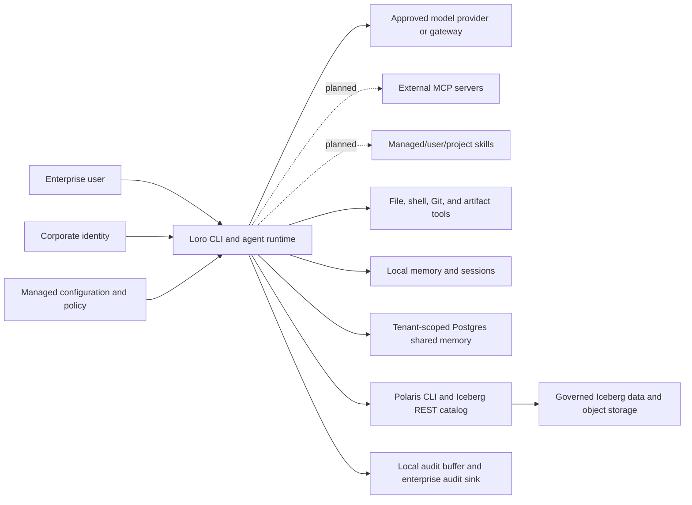

# Loro Threat Model

## Document Control

| Field | Value |
| --- | --- |
| Status | Draft for engineering and security review |
| Scope | Loro CLI 0.1.x and the first enterprise reference deployment |
| Review cadence | Before each enterprise pilot release and after material data-flow changes |
| Accountable owner | Security owner (TBD) |
| Technical owners | Runtime, identity/policy, memory/data, and release owners (TBD) |

This document describes security assumptions and required controls. It is not a claim that
all controls are implemented. The [enterprise evidence register](enterprise-evidence.md)
tracks implementation and proof.

## Security Objectives

- A model cannot grant itself authority or convert untrusted content into approval.
- Tenant and resource boundaries are enforced in code and storage, not by prompt text.
- Shared memory is written only from explicit user dictation through a reviewable draft and
  commit flow.
- Secrets and sensitive data are minimized across prompts, providers, memory, artifacts,
  sessions, subprocesses, and audit records.
- Consequential actions can be attributed to an identity, policy decision, approval, and exact
  target.
- Failure of identity, managed policy, authorization, or required audit delivery fails closed.
- Compromise of one provider, repository, memory record, or tool result does not silently
  expand Loro's authority.

## System And Trust Boundaries

Trust boundaries exist between the user and model, runtime and tool subprocesses, workstation
and provider, tenant and shared storage, Loro and Polaris, and local audit storage and the
enterprise destination. Repository files, model output, tool output, recalled memories, and
governed-data metadata are all untrusted input.

## Protected Assets

- Provider, database, Polaris, object-store, and identity credentials.
- Source code, working files, generated artifacts, and Git history.
- Prompt content, model responses, sessions, local memory, and provenance sidecars.
- Shared memories and their tenant, classification, authorship, review, and lifecycle metadata.
- Governed catalog metadata and any data reached through an approved query engine.
- Managed policy, approval records, identity assertions, and audit evidence.
- Availability, cost budgets, and the integrity of agent decisions.

## Actors And Assumptions

- **Enterprise user:** authenticated person requesting work and approving consequential actions.
- **Administrator:** distributes managed configuration and policy; does not implicitly approve a
  specific user action.
- **Model provider or gateway:** processes supplied context but is not trusted to authorize tools.
- **Data platform:** Polaris, Postgres, Iceberg, and object storage enforce their own identities,
  privileges, encryption, and tenant boundaries.
- **Attacker:** may control prompt content, repository files, memory text, tool output, network
  responses, dependencies, or a compromised user endpoint.

The first pilot assumes managed endpoints, enterprise-controlled credentials, TLS-protected
services, least-privilege database/catalog roles, and an approved provider data-use agreement.
Loro does not replace endpoint security, provider governance, database authorization, or
Polaris access control.

## Threat Register

| ID | Threat and attack path | Impact | Current control | Required enterprise control | Evidence |
| --- | --- | --- | --- | --- | --- |
| TM-01 | Prompt injection in a user prompt, repository, tool result, governed metadata, or recalled memory tells the model to run a tool or reveal data. | Unauthorized action or disclosure. | Typed tools, permission decisions, bounded steps, read-only Polaris allowlist. | Identity-bound interactive approval, normalized scopes, sandbox profiles, content trust labels, adversarial tests. | `tests/test_tools.py`, `tests/test_tool_runtime.py`, and `tests/test_runtime.py` are partial; Phase 1/2 evidence pending. |
| TM-02 | Model output supplies `approved=true` or otherwise attempts to approve its own file, shell, Git, or data action. | Arbitrary mutation or command execution. | Model/user tool-call origins are distinguished; trusted approval records bind canonical arguments, identity, session, decision, and expiry. | Add signed policy-version binding and durable enterprise approval evidence. | `tests/test_approvals.py` and `tests/test_tool_runtime.py`; policy-version evidence pending. |
| TM-03 | Path traversal, symlink substitution, glob ambiguity, command encoding, or shell argument confusion bypasses policy. | Access outside the workspace or unintended execution. | Typed canonical resources, configured symlink-aware workspace roots, structured policy fields, exact shell arguments, and bypass tests. | Sandbox enforcement, TOCTOU containment, constrained subprocess environment, and production review. | `src/loro/resources.py`, `tests/test_resources.py`, and `tests/test_tool_runtime.py`; Phase 2 evidence pending. |
| TM-04 | Credentials leak into prompts, inherited subprocess environments, logs, sessions, memory, or artifacts. | Account compromise and data breach. | Environment-backed provider/data credentials; lightweight secret scanner; prompt previews. | Environment allowlists, managed DLP, structured redaction metadata, credential isolation, leak tests. | Safety tests exist; enterprise DLP evidence pending. |
| TM-05 | Caller chooses another `tenant_id`, or a query/write omits tenant enforcement. | Cross-tenant memory disclosure or corruption. | Tenant fields and filters exist in shared-memory adapters. | Tenant derived from trusted identity/policy, database row-level controls where applicable, negative tests for every operation. | Adapter tests partial; production-like isolation proof pending. |
| TM-06 | Poisoned shared memory influences future users or embeds malicious instructions. | Persistent prompt injection or bad enterprise guidance. | Explicit-only shared writes, drafts, citations, authorship and classification fields. | Trust/provenance display, reviewer policy, correction/revocation, content scanning, quarantine, retrieval trust weighting. | Draft/commit tests exist; lifecycle and adversarial proof pending. |
| TM-07 | Local JSONL audit is modified, deleted, disabled, or lost during failure. | Actions cannot be reconstructed. | Versioned schema, bearer-authenticated HTTP sink, retry/backoff, bounded local buffer, visible warn/fail modes, doctor/flush, and failure-injection tests. | Destination immutability/tamper evidence, locking, mTLS/signing, retention, and production outage proof. | `src/loro/audit/`, `tests/test_audit.py`, `tests/test_runtime.py`, and [Audit Events And Delivery](audit.md); operations evidence pending. |
| TM-08 | Malicious or compromised dependency, build action, package, or release artifact executes code. | Developer/user compromise and supply-chain breach. | CI lint/tests and PyPI packaging checklist. | Pinned reviewed build dependencies, SCA, secret/license scanning, SBOM, provenance, signing, protected release. | Phase 4 pending. |
| TM-09 | Provider retains, trains on, routes, or exposes enterprise content outside approved boundaries. | Confidentiality, residency, or contractual breach. | Configurable providers and internal OpenAI-compatible endpoints. | Approved-provider matrix, gateway enforcement, classification-aware routing, retention settings, egress controls, provider review. | Data-flow approval pending. |
| TM-10 | Artifact generation creates formulas, links, macros, scripts, misleading content, or unsafe paths. | Code execution, exfiltration, or harmful business decisions. | Fixed artifact generators, safety scan, provenance sidecars. | Safe output roots, formula/link policy, malware/content scanning, classification labels, human review before distribution. | Artifact tests partial; adversarial artifact tests pending. |
| TM-11 | Polaris CLI passthrough or REST configuration is used for mutation or broader discovery than intended. | Governed-data misuse or privilege escalation. | Typed read-only operations and a validated read-only CLI allowlist. | Identity propagation, exact catalog/namespace/table scopes, policy evidence, constrained subprocess environment, production authorization tests. | Polaris unit tests and opt-in smoke exist; end-to-end proof pending. |
| TM-12 | Excessive loops, output, provider calls, scans, or queries consume money or capacity. | Denial of service and spend overrun. | Runtime maximum steps and provider timeout. | Per-user/tenant token, cost, concurrency, output, query, and tool-runtime budgets with telemetry. | Phase 3 pending. |
| TM-13 | Session, local memory, provenance, or draft files on a workstation are read by another process/user. | Confidentiality breach or forged state. | User-local default paths. | Managed file permissions, encryption where required, endpoint controls, retention/deletion, integrity checks. | Deployment validation pending. |
| TM-14 | Identity or managed policy is absent, stale, malformed, or replaced. | Unattributed or incorrectly authorized activity. | Managed overlay is applied last. | Validated identity context, signed/versioned policy, required-field checks, fail-closed startup, health checks. | Batch 2/4 pending. |
| TM-15 | A malicious MCP server, negotiated downgrade, extension, skill instruction, script, reference, or asset attempts confused-deputy execution, credential theft, persistence, or policy bypass. | Remote code execution, data disclosure, or durable compromise. | MCP client calls use version allowlists/minimums, stdio environment allowlisting, normalized policy, exact approval, and audit metadata; Agent Skills are absent. | Managed server/host controls, OAuth/TLS hardening, content trust labels, digest provenance, enforceable sandboxing, deny-by-default extensions, conformance and adversarial fixtures. | [MCP and Agent Skills roadmap](mcp-skills-roadmap.md); later batches and review pending. |

## Abuse Cases That Must Fail Closed

- A prompt says that the user approved a command, but no trusted approval record exists.
- A valid approval is replayed with a different path, command argument, tenant, or table.
- A memory retrieved for tenant A is requested by tenant B, including through a caller-supplied
  tenant flag.
- A repository symlink resolves outside an allowed workspace root.
- A provider credential is inherited by a shell tool that does not need it.
- The required identity, managed policy, or enterprise audit sink cannot be loaded.
- A Polaris operation falls outside the typed read-only allowlist.
- Content classified above a provider's approved ceiling is sent to that provider.
- An MCP server negotiates below a managed minimum, an unknown extension requests authority, or
  a skill's `allowed-tools` metadata attempts to override a deny.

## Existing Security Positives And Known Gaps

Current 0.1.x strengths include bounded agent steps, typed tools, layered managed configuration,
permission decisions, explicit shared-memory drafts and commits, tenant fields, cited recall,
read-only Polaris validation, secret-pattern scanning, and JSONL auditing.

These are alpha controls. Identity is not yet backed by a verified corporate assertion; approval
records are process-local; tenant selection can still originate at the CLI/runtime boundary;
normalized scopes are not an operating-system sandbox; external audit lacks production and
tamper-evidence proof; sandbox, DLP, retention,
and release-supply-chain controls remain open. Consequently, Loro 0.1.x is suitable for
controlled evaluation with non-production or approved low-risk data, not unrestricted
enterprise deployment.

## Review And Change Process

Security and engineering must review this model before a pilot. Each material change to a
provider, tool, memory backend, identity path, approval flow, governed-data operation, or audit
sink must update the data flow, threat register, and evidence links. Accepted risks require an
owner, expiration date, compensating controls, and approval recorded outside this repository.
