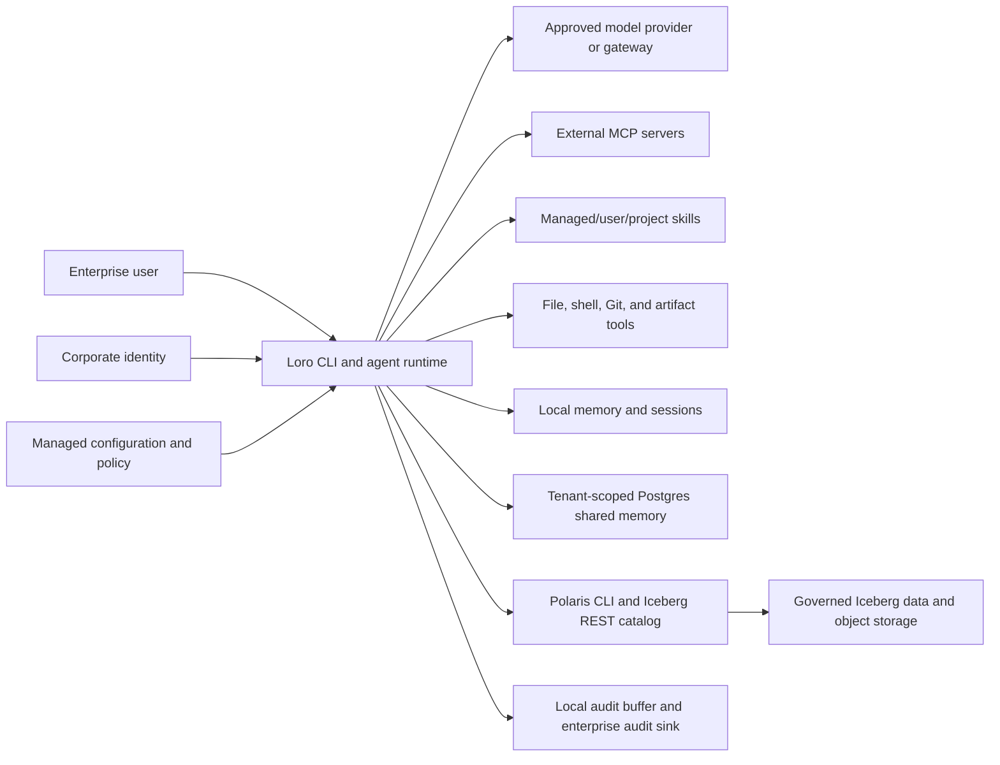

# Loro Threat Model

## Document Control

| Field | Value |
| --- | --- |
| Status | Draft; 0.22 sections are an engineering self-review, not an independent security review |
| Scope | Loro 0.22.0 (unreleased): the 0.17 baseline plus the 0.22 surfaces in [Release 0.22 Surfaces](#release-022-surfaces) |
| Review cadence | Before each enterprise pilot release and after material data-flow changes |
| Accountable owner | Security owner (TBD) |
| Technical owners | Runtime, identity/policy, memory/data, and release owners (TBD) |

This document describes security assumptions and required controls. It is not a claim that
all controls are implemented. The [enterprise evidence register](enterprise-evidence.md)
tracks implementation and proof.

## Security Objectives

- A model cannot grant itself authority or convert untrusted content into approval.
- Tenant and resource boundaries are enforced in code and storage, not by prompt text.
- Shared memory is written only from explicit user dictation through a reviewable draft and
  commit flow.
- Secrets and sensitive data are minimized across prompts, providers, memory, artifacts,
  sessions, subprocesses, and audit records.
- Consequential actions can be attributed to an identity, policy decision, approval, and exact
  target.
- Failure of identity, managed policy, authorization, or required audit delivery fails closed.
- Compromise of one provider, repository, memory record, or tool result does not silently
  expand Loro's authority.

## System And Trust Boundaries

```mermaid
flowchart LR
    U["Enterprise user"] --> CLI["Loro CLI and agent runtime"]
    IDP["Corporate identity"] --> CLI
    CFG["Managed configuration and policy"] --> CLI
    CLI --> P["Approved model provider or gateway"]
    CLI --> MCP["External MCP servers"]
    CLI --> SK["Managed/user/project skills"]
    CLI --> T["File, shell, Git, and artifact tools"]
    CLI --> LM["Local memory and sessions"]
    CLI --> PG["Tenant-scoped Postgres shared memory"]
    CLI --> PC["Polaris CLI and Iceberg REST catalog"]
    PC --> ICE["Governed Iceberg data and object storage"]
    CLI --> AUD["Local audit buffer and enterprise audit sink"]
```

Trust boundaries exist between the user and model, runtime and tool subprocesses, workstation
and provider, tenant and shared storage, Loro and Polaris, and local audit storage and the
enterprise destination. Repository files, model output, tool output, recalled memories, and
governed-data metadata are all untrusted input.

## Protected Assets

- Provider, database, Polaris, object-store, and identity credentials.
- Source code, working files, generated artifacts, and Git history.
- Prompt content, model responses, sessions, local memory, and provenance sidecars.
- Shared memories and their tenant, classification, authorship, review, and lifecycle metadata.
- Governed catalog metadata and any data reached through an approved query engine.
- Managed policy, approval records, identity assertions, and audit evidence.
- Availability, cost budgets, and the integrity of agent decisions.

## Actors And Assumptions

- **Enterprise user:** authenticated person requesting work and approving consequential actions.
- **Administrator:** distributes managed configuration and policy; does not implicitly approve a
  specific user action.
- **Model provider or gateway:** processes supplied context but is not trusted to authorize tools.
- **Data platform:** Polaris, Postgres, Iceberg, and object storage enforce their own identities,
  privileges, encryption, and tenant boundaries.
- **Attacker:** may control prompt content, repository files, memory text, tool output, network
  responses, dependencies, or a compromised user endpoint.

The first pilot assumes managed endpoints, enterprise-controlled credentials, TLS-protected
services, least-privilege database/catalog roles, and an approved provider data-use agreement.
Loro does not replace endpoint security, provider governance, database authorization, or
Polaris access control.

## Threat Register

| ID | Threat and attack path | Impact | Current control | Required enterprise control | Evidence |
| --- | --- | --- | --- | --- | --- |
| TM-01 | Prompt injection in a user prompt, repository, tool result, governed metadata, or recalled memory tells the model to run a tool or reveal data. | Unauthorized action or disclosure. | Typed tools, bounded steps, normalized policy, identity-bound approval, sandbox profiles, trust labels, and adversarial tests. | Production policy review, enforceable-platform evidence, and enterprise red-team validation. | `tests/test_tools.py`, `tests/test_tool_runtime.py`, `tests/test_runtime.py`, and deployment evidence remain. |
| TM-02 | Model output supplies `approved=true` or otherwise attempts to approve its own file, shell, Git, or data action. | Arbitrary mutation or command execution. | Model/user tool-call origins are distinguished; trusted approval records bind canonical arguments, identity, session, decision, and expiry. | Add signed policy-version binding and durable enterprise approval evidence. | `tests/test_approvals.py` and `tests/test_tool_runtime.py`; policy-version evidence pending. |
| TM-03 | Path traversal, symlink substitution, glob ambiguity, command encoding, or shell argument confusion bypasses policy. | Access outside the workspace or unintended execution. | Typed canonical resources, symlink-aware roots, exact shell arguments, named subprocess profiles, minimized environments, and optional required Bubblewrap. | Production escape/TOCTOU tests and supported-platform review. | Resource, runtime-tool, and sandbox bypass tests exist; production evidence remains. |
| TM-04 | Credentials leak into prompts, native tool arguments, inherited subprocess environments, logs, sessions, memory, or artifacts. | Account compromise and data breach. | Environment/OS-vault provider credentials; model text and nested native arguments use the same managed output policy; subprocess environments are allowlist-built and leak-tested. | Extend isolation to every subprocess family; managed DLP and structured redaction metadata. | `tests/test_runtime.py`, `tests/test_sandbox.py`, and safety tests exist; enterprise DLP evidence pending. |
| TM-05 | Caller chooses another `tenant_id`, or a query/write omits tenant enforcement. | Cross-tenant memory disclosure or corruption. | Managed identity binding, adapter mismatch rejection, isolated drafts, forced Postgres RLS/session context, Iceberg filter pushdown, and negative tests. | Verify least-privilege production database roles and Polaris authorization in live cross-tenant tests. | Repository controls implemented; production-like isolation proof pending. |
| TM-06 | Poisoned shared memory influences future users or embeds malicious instructions. | Persistent prompt injection or bad enterprise guidance. | Explicit-only shared writes, drafts, citations, provenance, classification, scanning, and correction/deletion/hold lifecycle controls. | Enterprise reviewer policy, quarantine workflow, retrieval trust weighting, and production adversarial proof. | Memory lifecycle, tenant, draft/commit, and runtime tests exist; production evidence remains. |
| TM-07 | Local JSONL audit is modified, deleted, disabled, or lost during failure. | Actions cannot be reconstructed. | Versioned schema, process-safe hash-chained JSONL, optional final-hash anchors, authenticated HTTP sink, retry/backoff, bounded buffer, warn/fail modes, doctor/flush/verify, and failure-injection tests. | Destination immutability, stronger transport/signing where required, retention, and production outage proof. | Audit integrity, delivery, and runtime tests exist; operations evidence remains pending. |
| TM-08 | Malicious or compromised dependency, build action, package, or release artifact executes code. | Developer/user compromise and supply-chain breach. | Pinned security/build tools, SCA, static/secret/license scans, SBOM, checksums, and GitHub/Sigstore build provenance. | Protected branch/tag rules, trusted publishing, reviewer ownership, and organization risk acceptance. | CI, Security Evidence, and Release Evidence workflows; repository-administration proof remains external. |
| TM-09 | Provider retains, trains on, routes, or exposes enterprise content outside approved boundaries. | Confidentiality, residency, or contractual breach. | Configurable providers and internal OpenAI-compatible endpoints. | Approved-provider matrix, gateway enforcement, classification-aware routing, retention settings, egress controls, provider review. | Data-flow approval pending. |
| TM-10 | Artifact generation creates formulas, links, macros, scripts, misleading content, or unsafe paths. | Code execution, exfiltration, or harmful business decisions. | Fixed artifact generators, safety scan, provenance sidecars. | Safe output roots, formula/link policy, malware/content scanning, classification labels, human review before distribution. | Artifact tests partial; adversarial artifact tests pending. |
| TM-11 | Polaris CLI passthrough or REST configuration is used for mutation or broader discovery than intended. | Governed-data misuse or privilege escalation. | Typed read-only operations, a validated allowlist, normalized scopes, approval, and a named subprocess profile. | Production identity/authorization and Bubblewrap evidence. | Polaris unit and sandbox-path tests plus opt-in smoke exist; end-to-end proof pending. |
| TM-12 | Excessive loops, output, provider calls, scans, or queries consume money or capacity. | Denial of service and spend overrun. | Per-task step, tool-call, model-byte, token, configured-cost, retry, timeout, and output limits. | Distributed per-user/tenant concurrency and spend enforcement with production telemetry. | Budget and provider-transport tests exist; distributed enforcement remains external. |
| TM-13 | Session, local memory, provenance, or draft files on a workstation are read by another process/user. | Confidentiality breach or forged state. | User-local default paths. | Managed file permissions, encryption where required, endpoint controls, retention/deletion, integrity checks. | Deployment validation pending. |
| TM-14 | Identity or managed policy is absent, stale, malformed, or replaced. | Unattributed or incorrectly authorized activity. | Managed overlay loads last; required mode, exact-input digest pinning, typed identity requirements, and diagnostics fail closed. | Verified corporate assertion source and authenticated/signed policy distribution. | Managed-config, identity, policy-integrity, and end-to-end tests exist; deployment proof remains external. |
| TM-15 | A malicious MCP server, negotiated downgrade, extension, skill instruction, script, reference, or asset attempts confused-deputy execution, credential theft, persistence, or policy bypass. | Remote code execution, data disclosure, or durable compromise. | MCP calls use version policy, transport controls, normalized approval, inert extensions, and audit; Skills use validation, digest provenance, bounded progressive loading, and script denial by default. | Enforceable sandboxing, hostile-server fixtures, official conformance evidence, and enterprise review. | [MCP Support Matrix](mcp-support-matrix.md), [Agent Skills](skills.md), local security tests, and external deployment proof. |
| TM-16 | An untrusted Agentic Graph uses prompt injection, command criteria, remote references, excessive fan-out, weak success checks, or misleading model tiers to gain authority or exhaust resources. | Unauthorized side effects, code execution, data disclosure, runaway spend, or false completion. | Three-layer validation, managed `LP` policy, permission intersection, sandboxed command checks disabled by default, local digest-pinned references, hard node/loop/map/parallel/cost bounds, strict AGX without host evaluation, harness criteria, identity gates, and digest-guarded resume. | Production sandbox, provider budget, graph-policy, and hostile-graph review remain enterprise deployment evidence. | [Agentic Graph Policy](agraph-policy.md) and `tests/test_agraph.py`. |
| TM-17 | A session sends a message containing a permission request, forged user instruction, or `approved=true` and the receiver treats it as authoritative. | Cross-session confused deputy and unauthorized tool execution. | Every message is labeled untrusted with `carries_user_authority=false`; sends require independent policy/approval; resume does not parse relayed text as user tool directives. | Distributed mailbox authentication, concurrency/retention controls, and enterprise adversarial review. | `tests/test_session_messages.py` and [Cross-Session Messaging](session-messaging.md). |
| TM-18 | A forged, replayed, cross-workspace, or compromised chat message launches remote work or captures a reply. | Unauthorized execution, disclosure, replay, or tenant confusion. | Platform signatures/secrets, pre-parse verification, signed freshness checks, durable hashed deduplication with rollback on persistence/submission failure, workspace/channel/user allowlists, explicit identity mapping, bounded queues, untrusted-content labels, OS-vaulted credentials, and existing policy/approval controls. | TLS reverse proxy, platform app governance, credential rotation, retention policy, production hostile-event tests, and a trusted out-of-band approval service. | `tests/test_gateway.py`, [Channel Gateways](channel-gateways.md), and deployment evidence. |
| TM-19 | A malicious site, remote client, or local process drives the Web UI API, steals a transcript, or forges an approval. | Unauthorized execution, data disclosure, or confused-deputy approval. | Loopback default, explicit-IP binding, bearer requirement off loopback, same-site HTTP-only session cookie, CSRF token, origin checks, no CORS, CSP/frame denial, bounded messages/concurrency, redacted settings, and the existing identity/policy/approval/audit path. | Approved TLS reverse proxy, corporate identity, distributed rate limits, retention controls, browser-hardening review, and multi-user authorization before shared deployment. | `tests/test_webui.py`, frontend tests, and [Local Web UI](webui.md). |
| TM-20 | A forged, expired, wrong-audience, algorithm-confused, or oversized bearer token is accepted, or a hostile JWKS endpoint swaps signing keys. | Impersonation and privilege escalation across the Web UI and gateway. | See [OIDC and JWT verification](#oidc-and-jwt-verification). | Key revocation latency, IdP compromise, and clock skew policy. | `tests/test_oidc.py`, `tests/test_webui_oidc.py`, `tests/test_gateway_oidc.py`, `tests/test_security_review.py`. |
| TM-21 | A signed-in user reaches an API route above their role, approves their own action, or rides another user's session. | Unauthorized execution or approval. | See [RBAC and multi-user server](#rbac-and-multi-user-server). | Single-process session store, no per-user rate limits. | `tests/test_webui_rbac.py`, `tests/test_webui_oidc.py`. |
| TM-22 | Concurrent deciders, a database outage, or a tampered row corrupts the shared approval authority. | Lost, duplicated, or forged approval decisions. | See [Postgres approval authority](#postgres-approval-authority). | Database administrators can edit rows; no row signatures. | `tests/integration/test_aais_postgres_integration.py`, `tests/test_aais_recovery.py`, `tests/integration/test_postgres_recovery_integration.py`. |
| TM-23 | A plugin or command hook runs attacker code, hides a tool from policy, or blocks audit. | Code execution with Loro's privileges. | See [Plugins and hooks](#plugins-and-hooks). | Installed plugins run in-process with full privileges. | `tests/test_plugins.py`, `tests/test_security_review.py`. |
| TM-24 | `web.fetch` reaches internal services (SSRF) through redirects, DNS rebinding, IPv6 tunnels, or literal IPs, or floods the context. | Metadata-service credential theft or internal data disclosure. | See [web.fetch](#webfetch-ssrf). | Allowlisted domains are trusted to serve honest content; prompt injection in fetched text. | `tests/test_coding_tools.py`, `tests/test_security_review.py`. |
| TM-25 | `patch.apply` writes or reads outside the workspace through traversal, symlinks, renames, or dry runs. | File disclosure or tampering outside the project. | See [patch.apply](#patchapply). | Time-of-check to time-of-use races with a concurrent local attacker. | `tests/test_coding_tools.py`, `tests/test_security_review.py`. |
| TM-26 | `tests.run` executes hostile project code or uses runner options to delete or write outside the project. | Code execution and data loss. | See [tests.run](#testsrun). | Running tests is running project code by design. | `tests/test_coding_tools.py`, `tests/test_security_review.py`. |
| TM-27 | A container-sandboxed command escapes, sees host secrets, or mounts sensitive host paths. | Host compromise or credential exposure. | See [Container sandbox](#container-sandbox). | Shared-kernel escapes without gVisor; engine daemon trust. | `tests/test_container_sandbox.py`, `tests/test_security_review.py`. |
| TM-28 | Telemetry or SIEM forwarding leaks prompts or secrets, or a crafted field forges log records. | Disclosure to observability vendors or misleading audit. | See [OTel and SIEM forwarding](#otel-and-siem-forwarding). | Syslog transport is plaintext; collectors are trusted. | `tests/test_telemetry_forwarding.py`, `tests/test_security_review.py`. |
| TM-29 | An evidence bundle leaks secrets, is forged, or a hostile bundle exhausts the verifier. | Disclosure, false assurance, or denial of service. | See [Evidence bundles](#evidence-bundles). | Bundles are not signed; digests prove consistency, not origin. | `tests/test_evidence.py`, `tests/test_security_review.py`. |
| TM-30 | `--prompt-file` reads an unexpected file or confuses stdin approval decisions. | Disclosure to a provider or forged approvals. | See [Prompt files](#prompt-files). | The operator chooses the file; its content goes to the provider. | `tests/test_cli_run.py`. |

## Release 0.22 Surfaces

Release 0.22 adds verified identity, a multi-user server, a shared approval authority, plugins,
three coding tools, a container backend, telemetry export, and evidence bundles. Each surface
below lists what it protects, STRIDE threats, the mitigations in code, what is left, and the
tests that cover it. All of these surfaces are labeled experimental in 0.22.

**This section is a self-review, not a penetration test.** The engineer who built the features
reviewed them, probed a handful of bypasses by hand, fixed what was found, and added regression
tests. No independent tester, fuzzing campaign, or external audit has looked at this code. Treat
"no finding" below as "not found in a self-review", which is weaker evidence than it sounds.

### OIDC And JWT Verification

- **Assets:** bearer tokens, the IdP signing keys Loro trusts, identity claims that drive RBAC,
  PKCE verifiers, and the web session cookie.
- **Threats:** spoofing with forged tokens or `alg=none` and HS256-with-public-key confusion;
  tampering with the JWKS response or discovery document; spoofing through `jku`/`x5u` header
  URLs; denial of service with huge tokens or forced JWKS refetch storms; elevation through a
  malformed `aud` or role claim.
- **Mitigations:** `src/loro/oidc.py` accepts only an asymmetric algorithm allowlist, requires the
  JWK `kty` to match the algorithm, takes keys only from the issuer's discovered JWKS (header `jku`, `x5u`, and `jwk` are never
  followed), fetches discovery and JWKS
  over HTTPS (loopback excepted for tests) without redirects and with a 1 MB cap, refetches keys on
  unknown `kid` at most once per 30 seconds, rejects tokens over 16 KB before parsing, and checks
  `iss`, `aud` (string or list of strings only), `exp`, `nbf`, and `iat` with bounded leeway. Web
  login in `src/loro/webui/auth.py` uses PKCE S256, `state` and `nonce`, and `safe_next` keeps the
  post-login redirect same-origin. Off loopback the Web UI requires a verified bearer or a
  signed-in session; there is no unauthenticated fallback.
- **Residual risk:** a revoked key stays valid until the JWKS changes and the cooldown passes;
  compromise of the IdP or its TLS is out of scope; the cache is per process.
- **Tests:** `tests/test_oidc.py`, `tests/test_webui_oidc.py`, `tests/test_gateway_oidc.py`,
  `tests/test_security_review.py`.

### RBAC And Multi-User Server

- **Assets:** runs, transcripts, approvals, settings, and the server's own tool authority.
- **Threats:** elevation by calling a route that lacks a role check or by path tricks
  (`//api/...`, encoded slashes, method overrides); spoofing through a stolen session cookie;
  CSRF against mutating routes; repudiation of approvals; information disclosure of other users'
  transcripts.
- **Mitigations:** `src/loro/webui/server.py` authorizes in one middleware before routing, and
  `src/loro/webui/rbac.py` `required_permission` derives the needed permission from method and
  path; reads need `read`, and any mutating route not in the rule table needs `admin`. Roles are `viewer` (read), `operator` (read and
  operate), `approver` (read and approve), and `admin`; an operator cannot approve without also
  holding `approver`. Mutating routes need the per-session CSRF token, and a
  cross-origin `Origin` header is rejected. The session cookie is HTTP-only and `SameSite=Strict`
  (`Secure` when served over HTTPS); the short-lived login-state cookie is `Lax` so the IdP
  redirect can return. Approval decisions carry the deciding identity into the audit trail.
- **Residual risk:** sessions live in process memory, so there is no cross-replica logout; no
  per-user rate limiting; all operators share the server's tool authority and workspace, so this
  is team mode, not tenant isolation.
- **Self-review probe:** path-normalization variants (`//api/status`, `/api//status`,
  `/%61pi/status`, trailing slashes, `HEAD`/`OPTIONS`) either hit the static SPA fallback, 401, 403,
  or 405. No bypass found.
- **Tests:** `tests/test_webui_rbac.py`, `tests/test_webui_oidc.py`.

### Postgres Approval Authority

- **Assets:** pending and decided approval records shared by several Loro processes.
- **Threats:** tampering through lost updates when two deciders race; repudiation if decisions are
  overwritten; denial of service through lock waits or an unreachable database; information
  disclosure through connection errors.
- **Mitigations:** `src/loro/aais_postgres.py` implements the `aais.backends` protocols: one
  JSONB row per stream, locked with `SELECT ... FOR UPDATE` for the whole transaction, a row
  version counter, and a quarantine table plus `recovery` column for rows that fail validation.
  The AAIS state machine is `aais.store.ApprovalAuthority` (decided requests cannot be
  re-decided). Lock waits are bounded with `lock_timeout`, SQL is parameterized, errors never
  include DSN credentials, and an unavailable database fails closed with a `StoreError`. The
  backend passes the AAIS conformance kit. `src/loro/aais_bridge.py` binds decisions to the canonical arguments.
- **Residual risk:** a database administrator can rewrite rows; rows are not signed; the
  connection string is operator-configured and must not be world readable.
- **Tests:** `tests/integration/test_aais_postgres_integration.py`, `tests/test_aais_recovery.py`,
  `tests/integration/test_postgres_recovery_integration.py`.

### Plugins And Hooks

- **Assets:** the Loro process, its credentials, and the policy path every tool call takes.
- **Threats:** elevation by a planted package that registers a `loro.plugins` entry point from the
  working directory; tampering with policy by a plugin tool that skips permission checks; denial of
  service by a slow or crashing hook; spoofing of a hook decision.
- **Mitigations:** `src/loro/plugins.py` loads plugins only when `plugins.enabled` is set and the
  entry point is named in `plugins.enabled`, refuses distributions installed inside the current
  working directory (a repository cannot plant one), routes plugin tools through the same
  permission, approval, and audit path as built-in tools, and runs command hooks in a named
  sandbox profile with a timeout. Exit status 2 blocks the call; other failures follow
  `plugins.hook_failure`, which defaults to `deny` (fail closed).
- **Residual risk:** an allowed plugin runs in-process with full privileges; a hook command
  receives tool arguments in `LORO_HOOK_EVENT`; project configuration is trusted input, so a
  repository `.loro` config that defines hooks carries the same trust as its permission settings.
- **Tests:** `tests/test_plugins.py`, `tests/test_security_review.py`.

### web.fetch (SSRF)

- **Assets:** internal services, cloud metadata endpoints, and the model context budget.
- **Threats:** information disclosure through requests to private, loopback, link-local, or
  metadata addresses; bypass through redirects, DNS rebinding, literal and decimal IPs, IPv6
  forms (mapped, NAT64, 6to4, Teredo, IPv4-compatible), embedded credentials, or ambient proxies;
  denial of service through large or slow bodies.
- **Mitigations:** `src/loro/tools/web_fetch.py` requires HTTPS (unless `allow_http`) and a
  domain on `web_fetch.allowed_domains`, rejects literal IPs and userinfo, resolves the name and
  refuses any non-public answer, repeats every check on each redirect hop (bounded count), ignores
  proxy environment variables, confirms the connected peer address after connecting (DNS rebinding),
  accepts only text content types, and caps bytes and wall time. Uses the `network` permission.
- **Residual risk:** an allowlisted domain can return prompt injection; a CDN on the allowlist can
  host attacker content; peer confirmation depends on the transport exposing `server_addr`, and
  fails closed when it does not.
- **Tests:** `tests/test_coding_tools.py`, `tests/test_security_review.py`.

### patch.apply

- **Assets:** files inside and outside the workspace.
- **Threats:** tampering or disclosure through `../` paths, absolute paths, symlinked files or
  directories, rename sources outside the root, and dry runs used as a read oracle.
- **Mitigations:** `src/loro/tools/patching.py` resolves every target and rename source and
  requires it under the resolved root (so a symlink pointing outside is refused), locates every
  hunk before writing, and writes each file atomically. `src/loro/tool_runtime.py` checks the `edit` permission per
  touched path, and dry runs now require read authorization for each path.
- **Residual risk:** a concurrent local process could swap a path between check and write.
- **Tests:** `tests/test_coding_tools.py`, `tests/test_security_review.py`.

### tests.run

- **Assets:** the host, files outside the project, and credentials in the environment.
- **Threats:** elevation because tests execute project code; tampering through runner options
  that write or delete elsewhere (pytest wipes `--basetemp`); information disclosure through the
  inherited environment; denial of service through long runs.
- **Mitigations:** `src/loro/tools/test_runner.py` builds a fixed argv with no shell, allows at
  most 32 simple tokens, refuses absolute, `~`, and `..` paths, and refuses options that write,
  delete, or re-point configuration. `src/loro/tool_runtime.py` runs it through the
  `test-runner` sandbox profile with an environment allowlist, a timeout, an output cap, and the
  `shell` permission (`ask` by default). Interpreters inside the workspace are not trusted.
- **Residual risk:** without an OS-enforced sandbox (Bubblewrap or the container backend) the
  project's tests run with the user's privileges. Approve `tests.run` only for code you would run
  yourself.
- **Tests:** `tests/test_coding_tools.py`, `tests/test_security_review.py`.

### Container Sandbox

- **Assets:** the host filesystem, host credentials, and the network.
- **Threats:** elevation through container escape or privileged options; information disclosure of
  secrets through `docker run` arguments visible in `ps`, or through a mount of `$HOME` or `/`;
  tampering through mount-option injection in a path; denial of service through fork bombs or
  memory.
- **Mitigations:** `src/loro/sandbox.py` runs `--read-only`, `--cap-drop ALL`,
  `no-new-privileges`, a pids and memory limit, a non-root `--user`, `--network none` unless the
  profile allows it, and gVisor (`runsc`) when available or required. Environment values are
  passed by name (`--env NAME`) and supplied through the engine's own environment, so they never
  appear on a command line. It refuses to mount a filesystem root, the home directory, or paths
  containing `:`, `,`, or newlines, and only mounts roots inside workspace policy.
- **Residual risk:** without gVisor the container shares the host kernel; whoever can talk to the
  Docker daemon is effectively root; image provenance is the operator's choice.
- **Tests:** `tests/test_container_sandbox.py`, `tests/test_security_review.py`.

### OTel And SIEM Forwarding

- **Assets:** prompts, tool arguments, secrets, and audit integrity at the collector.
- **Threats:** information disclosure through span attributes or recorded exception messages;
  tampering or spoofing of SIEM records through newline or delimiter injection; repudiation if
  forwarding silently drops events.
- **Mitigations:** `src/loro/telemetry.py` records only fixed attributes (mode, provider, model,
  agent profile name, step, tool name, outcome), never prompts or arguments, and records the exception
  type but not its message. `src/loro/audit/forwarding.py` escapes CEF header and extension fields,
  replaces control characters, and frames TCP syslog with octet counting. The hash-chained local
  audit log remains the record of truth.
- **Residual risk:** syslog over UDP or TCP is plaintext and unauthenticated, so run it to a local
  relay or over a trusted network; OTLP endpoint TLS depends on configuration; model and provider
  names are disclosed to the collector.
- **Tests:** `tests/test_telemetry_forwarding.py`, `tests/test_security_review.py`.

### Evidence Bundles

- **Assets:** run transcripts, tool results, audit slices, and the claim that a bundle is intact.
- **Threats:** information disclosure of secrets in tool output; tampering with a bundle after
  export; denial of service through zip bombs or oversized archives given to `verify`.
- **Mitigations:** `src/loro/evidence.py` redacts tool results with the data-protection engine,
  writes a canonical stored zip with per-member digests and a manifest digest, includes the audit
  hash-chain slice, and on verify checks file size, member count, and total uncompressed size
  before reading any member.
- **Residual risk:** bundles are not signed, so digests prove internal consistency, not who made
  them; redaction is pattern based.
- **Tests:** `tests/test_evidence.py`, `tests/test_security_review.py`.

### Prompt Files

- **Assets:** local files and the stdin approval channel.
- **Threats:** information disclosure by reading a large or unintended file; spoofing of approval
  decisions if the prompt and `--approval-stdio` shared stdin.
- **Mitigations:** `_task_prompt` in `src/loro/cli/core.py` requires a regular file, enforces
  `runtime.max_model_input_bytes`, refuses `-` so stdin stays reserved for approval decisions, and
  rejects passing both a prompt and a file.
- **Residual risk:** the operator picks the file, and its content is sent to the provider.
- **Tests:** `tests/test_cli_run.py`.

### Findings Fixed During The 0.22 Self-Review

| Surface | Finding | Fix |
| --- | --- | --- |
| web.fetch | NAT64 (`64:ff9b::/96`, `64:ff9b:1::/48`) and IPv4-compatible (`::a.b.c.d`) addresses wrapping private IPv4 were treated as public. | `public_address` unwraps them, plus 6to4 and Teredo. |
| OIDC | A non-string `aud` raised an unhandled error (HTTP 500); token size was unbounded. | Clean rejection for malformed audience; 16 KB token cap. |
| Web login | `safe_next` allowed tab and other control characters, which browsers strip, so `/\t/evil.example` became an open redirect. | Control characters are refused. |
| Telemetry | Spans recorded exception messages, which can carry provider response text or paths. | Only the exception type is recorded. |
| patch.apply | A rename source reached through a symlinked directory could copy a file from outside the workspace. | Rename sources must resolve under the root. |
| patch.apply | Dry runs read files without read authorization, a content oracle under `edit="deny"`. | Dry runs check read permission per path. |
| Container | Environment values appeared in the `docker run` argv; `$HOME` or `/` could be mounted; `:` in a path could inject mount options. | Values passed by name; unsafe mounts refused. |
| Evidence | `verify` read members before checking archive size and member count. | Size, count, and total-size checks come first. |
| Plugins | A distribution installed inside the working directory could register an allowed entry point name. | Such distributions are refused. |
| SIEM | CEF header fields escaped `\n` but not `\r` or other control characters. | All control characters are replaced. |
| tests.run | Runner options such as `--basetemp=/path` (which pytest wipes), `--junitxml`, or cargo `--target-dir` could write or delete outside the project. | Such options and absolute or `..` paths are refused. |

## Abuse Cases That Must Fail Closed

- A prompt says that the user approved a command, but no trusted approval record exists.
- A valid approval is replayed with a different path, command argument, tenant, or table.
- A memory retrieved for tenant A is requested by tenant B, including through a caller-supplied
  tenant flag.
- A repository symlink resolves outside an allowed workspace root.
- A provider credential is inherited by a shell tool that does not need it.
- The required identity, managed policy, or enterprise audit sink cannot be loaded.
- A Polaris operation falls outside the typed read-only allowlist.
- Content classified above a provider's approved ceiling is sent to that provider.
- An MCP server negotiates below a managed minimum, an unknown extension requests authority, or
  a skill's `allowed-tools` metadata attempts to override a deny.
- A remote message claims to approve an action, arrives from an unmapped user/workspace/channel,
  has an invalid signature, or repeats a previously processed message id.
- A cross-origin browser request lacks the Web UI session/CSRF binding, a non-loopback server lacks
  a bearer token, or a profile revision changes during an existing bot conversation.
- A bearer token uses `alg=none`, an HMAC algorithm, an unknown `kid`, a foreign audience, or a
  non-string audience.
- A viewer or operator calls an approval route, or any caller reaches an unknown API route.
- `web.fetch` is redirected to, or resolves to, a private, loopback, metadata, or tunnelled address.
- A patch path, rename source, or symlink resolves outside the workspace.
- A plugin is not named in `plugins.enabled` or is installed inside the working directory.
- A container sandbox would mount `/`, `$HOME`, or a path outside workspace policy.

## Existing Security Positives And Known Gaps

### Open Agent Profile Threats

OAP documents and state are untrusted durable inputs. Loro assigns trust from the discovery root,
rejects root and symlink escapes, bounds count and bytes, and resolves profiles without network or
write side effects. Effective profiles intersect rather than merge authority; tools, permissions,
workspace roots, model routes, runtime budgets, and writeback cannot exceed managed configuration.

Prior-session state is delimited as untrusted and cannot carry approval authority. State values are
data-protected before injection, proposal persistence, and profile persistence. Delta application
is locked, revision- and spec-digest-bound, `/state`-only, atomically replaced, and directory-fsynced
where supported. Capability proposals never auto-apply. Remaining risk includes model susceptibility
to prompt injection from profile role/state, local users able to mutate user/project profile files,
and single-host advisory lock semantics. Release 0.17.0 pins the canonical upstream OAP fixtures;
protected release-commit evidence and independent operational review remain separate gates.

Current 0.17.0 strengths include bounded agent steps and budgets, typed tools, layered managed configuration,
permission decisions, explicit shared-memory drafts and commits, tenant fields, cited recall,
read-only Polaris validation, secret-pattern scanning, and JSONL auditing.

These are stabilization controls. Identity is not yet backed by a verified corporate assertion; approval
records are local rather than an enterprise approval service; tenant isolation requires managed `identity` mode and verified identity;
normalized scopes use optional Bubblewrap only for shell/Skill execution; external audit lacks
production and tamper-evidence proof; full subprocess coverage, DLP, retention,
and external release-administration controls remain open. Consequently, Loro 0.17.0 is suitable for
controlled evaluation with non-production or approved low-risk data, not unrestricted
enterprise deployment.

## Review And Change Process

Security and engineering must review this model before a pilot. Each material change to a
provider, tool, memory backend, identity path, approval flow, governed-data operation, or audit
sink must update the data flow, threat register, and evidence links. Accepted risks require an
owner, expiration date, compensating controls, and approval recorded outside this repository.
